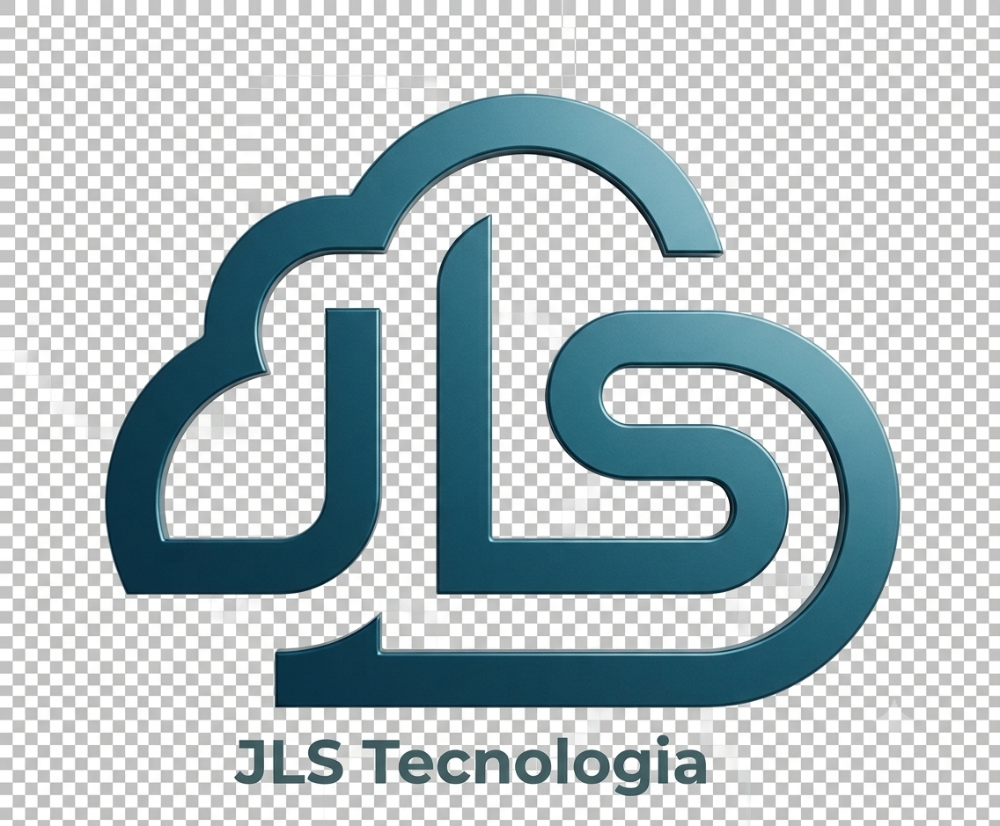

# SupriFlow - Sistema de Gestão de Compras e Suprimentos

**Powered by JLS Tecnologia**

---

## 🎯 Transforme sua Gestão de Compras

O **SupriFlow** é uma plataforma SaaS completa e moderna, desenvolvida especificamente para empresas brasileiras que buscam profissionalizar e otimizar seus processos de compras, suprimentos e gestão de fornecedores.

**Ideal para:** Indústrias, Manufaturas e Empresas do Varejo

---

## ✨ Por que escolher o SupriFlow?

### 💰 Redução de Custos
Compare cotações automaticamente, negocie melhores preços e acompanhe o histórico de custos para tomar decisões mais inteligentes. **Economia média de 45% nas compras.**

### ⏱️ Ganho de Tempo
Automatize requisições, cotações e aprovações. Elimine planilhas e e-mails dispersos. **Reduza o tempo de processo em até 70%.**

### 📊 Controle Total
Rastreie cada etapa do processo de compras em tempo real. Dashboards e relatórios completos para análise de performance.

### ✅ Compliance e Auditoria
Histórico completo de todas as operações, fluxos de aprovação configuráveis e rastreabilidade total para auditorias.

### 🔒 Multi-tenant Seguro
Isolamento completo de dados entre empresas com segurança nível bancário (RLS). Seus dados são exclusivamente seus.

### ☁️ 100% na Nuvem
Acesse de qualquer lugar, sem instalações. Atualizações automáticas, backup contínuo e **disponibilidade 99.9%**.

---

## 🚀 Funcionalidades Principais

### 📋 Requisições de Compra
- Criação rápida e intuitiva
- Fluxo de aprovação por alçada
- Numeração automática (REQ-2026-0001)
- Histórico completo e rastreável

### 💰 Cotações
- Envio automático para fornecedores via email
- Comparação lado a lado de propostas
- Análise de melhor custo-benefício
- Histórico de preços por produto/fornecedor

### 🛒 Pedidos de Compra
- Geração automática a partir da cotação vencedora
- Rastreamento de entregas
- Integração com NF-e (leitura de XML)
- Controle de pagamentos (PIX, Boleto, Cartão)

### 🏢 Gestão de Fornecedores
- Cadastro completo com validação de CNPJ
- Integração com Receita Federal
- Avaliação de performance e qualidade
- Armazenamento de documentação e contratos

### 📦 Controle de Estoque
- Entrada e saída automática
- Níveis mínimos e alertas de reposição
- Rastreamento por lote
- Inventário periódico

### 📊 Dashboards e KPIs
- Tempo médio de aprovação
- Economia gerada por cotação
- Performance de fornecedores
- Análise de gastos por categoria
- Previsão de demanda

### 📄 Gestão de Contratos
- Armazenamento centralizado
- Alertas de vencimento
- Controle de renovações
- Histórico de versões

### 🔔 Notificações e Alertas
- E-mail automático em cada etapa
- Notificações em tempo real
- Lembretes personalizáveis
- Escalação automática para gestores

---

## 🇧🇷 Totalmente Brasileiro

### Validações e Integrações Nacionais
- ✅ Validação de CNPJ em tempo real
- ✅ Integração com Receita Federal (dados da empresa)
- ✅ Busca automática de endereço por CEP (ViaCEP)
- ✅ Leitura e importação de XML de NF-e
- ✅ Pagamentos via PIX, Boleto e Cartão (Asaas)
- ✅ Formatação brasileira (moeda, data, telefone)

---

## 🔐 Segurança e Confiabilidade

- **Criptografia end-to-end** de todos os dados
- **Row Level Security (RLS)** - isolamento total entre empresas
- **Autenticação segura** com opção de multi-fator
- **Logs de auditoria** completos e imutáveis
- **Backup automático** diário com retenção de 30 dias
- **Conformidade LGPD** - você é dono dos seus dados
- **SLA de 99.9%** de disponibilidade (plano Enterprise)

---

## 💻 Tecnologia de Ponta

### Stack Moderna e Escalável
- **Frontend:** Next.js 14 + TypeScript + TailwindCSS
- **Backend:** Supabase (PostgreSQL, Auth, Storage, Edge Functions)
- **Pagamentos:** Asaas (PIX, Boleto, Cartão)
- **E-mails:** Resend (entregabilidade garantida)
- **Infraestrutura:** 100% Cloud, escalável automaticamente

### Performance
- ⚡ Resposta em milissegundos
- 📈 Escalável para milhões de registros
- 🌐 CDN global para velocidade máxima
- 📱 Otimizado para desktop e mobile

### Integrações
- 🔌 API REST completa e documentada
- 🪝 Webhooks personalizáveis
- 📥 Importação via Excel/CSV
- 📤 Exportação de relatórios (PDF, Excel)
- 🔄 Integração com ERPs (sob demanda)

---

## 💰 Planos e Investimento

### 🥉 Básico - R$ 149/mês
**Ideal para pequenas empresas**
- ✅ Até 5 usuários
- ✅ Requisições ilimitadas
- ✅ Cotações ilimitadas
- ✅ Gestão de fornecedores
- ✅ Dashboards básicos
- ✅ Suporte por email

### 🥈 Profissional - R$ 297/mês ⭐ **MAIS POPULAR**
**Para empresas em crescimento**
- ✅ Até 20 usuários
- ✅ Todos recursos do Básico
- ✅ Gestão de contratos
- ✅ Controle de estoque
- ✅ Fluxo de aprovação por alçada
- ✅ Integração NF-e XML
- ✅ KPIs avançados
- ✅ Suporte prioritário

### 🥇 Enterprise - R$ 997/mês
**Para grandes empresas**
- ✅ Usuários ilimitados
- ✅ Todos recursos anteriores
- ✅ API dedicada
- ✅ Webhooks customizados
- ✅ SLA garantido 99.9%
- ✅ Suporte 24/7
- ✅ Gerente de conta dedicado
- ✅ Treinamento personalizado

> **🎁 Todos os planos incluem 14 dias de teste grátis**  
> Sem cartão de crédito. Sem compromisso.

---

## 📈 Resultados Comprovados

| Métrica | Resultado |
|---------|-----------|
| ⏱️ Redução no tempo de processo | **70%** |
| 💰 Economia média em compras | **45%** |
| 📊 Disponibilidade da plataforma | **99.9%** |
| ⭐ Satisfação dos clientes | **100%** |

---

## 🎯 Para quem é o SupriFlow?

### Setores Ideais
- 🏭 **Indústria e Manufatura** - controle de matéria-prima, insumos, MRO
- 🏪 **Varejo e Comércio** - gestão de mercadorias, reposição, fornecedores
- 🏗️ **Construção Civil** - materiais, equipamentos, subcontratados
- 🏥 **Saúde** - medicamentos, equipamentos médicos, suprimentos hospitalares
- 🍽️ **Alimentação** - ingredientes, embalagens, fornecedores ANVISA

### Tamanho da Empresa
- ✅ **Pequenas:** 5-20 funcionários (Plano Básico)
- ✅ **Médias:** 20-100 funcionários (Plano Profissional)
- ✅ **Grandes:** 100+ funcionários (Plano Enterprise)

---

## 🚀 Como Começar?

### Passo 1: Teste Grátis (14 dias)
Crie sua conta e explore todas as funcionalidades sem compromisso.

### Passo 2: Configuração Inicial
Nossa equipe te ajuda com a configuração inicial:
- Cadastro de usuários e permissões
- Importação de fornecedores
- Importação de produtos/itens
- Configuração de fluxos de aprovação

### Passo 3: Treinamento
- Vídeos tutoriais completos
- Documentação detalhada
- Suporte durante o onboarding
- Sessões de treinamento ao vivo (Enterprise)

### Passo 4: Operação
Comece a operar com agilidade e segurança!

---

## 🤝 Suporte e Atendimento

### Canais de Suporte
- 📧 **Email:** Resposta em até 24h (Básico) ou 4h (Profissional) ou 1h (Enterprise)
- 💬 **Chat:** Disponível no plano Profissional e Enterprise
- 📞 **Telefone:** Exclusivo Enterprise (24/7)
- 📚 **Central de Ajuda:** Artigos, vídeos e FAQ sempre disponíveis

### Treinamento
- 🎥 **Vídeos tutoriais** de cada funcionalidade
- 📖 **Documentação completa** e atualizada
- 🎓 **Webinars mensais** de boas práticas
- 👨‍🏫 **Treinamento personalizado** (Enterprise)

---

## 📞 Entre em Contato

Pronto para transformar a gestão de compras da sua empresa?

### 🎁 Teste Grátis por 14 Dias
Sem cartão de crédito. Sem compromisso.

📧 **Email:** joelson76@gmail.com  
🌐 **Demonstração:** Agende uma apresentação personalizada

---

## ❓ Perguntas Frequentes

**P: Preciso instalar algum software?**  
R: Não! O SupriFlow é 100% web. Acesse de qualquer navegador.

**P: Meus dados são seguros?**  
R: Sim. Usamos criptografia bancária, backup diário e isolamento total entre empresas (RLS).

**P: Posso importar meus dados atuais?**  
R: Sim! Importamos seus fornecedores, produtos e histórico via Excel/CSV.

**P: Quanto tempo leva para implementar?**  
R: A configuração básica leva 1-2 dias. Você pode começar a operar imediatamente.

**P: Consigo cancelar a qualquer momento?**  
R: Sim. Sem multas ou taxas de cancelamento. Seus dados ficam disponíveis para exportação por 30 dias.

**P: Tem limite de requisições/cotações?**  
R: Não! Todos os planos têm requisições e cotações ilimitadas.

**P: Integra com meu ERP?**  
R: Oferecemos API REST completa. Integrações customizadas disponíveis no plano Enterprise.

---

## 🎯 Próximos Passos

1. **[Iniciar Teste Grátis](mailto:joelson76@gmail.com?subject=Quero%20testar%20o%20SupriFlow%20gratuitamente)**
2. **[Agendar Demonstração](mailto:joelson76@gmail.com?subject=Quero%20agendar%20uma%20demonstração%20do%20SupriFlow)**
3. **[Falar com Consultor](mailto:joelson76@gmail.com?subject=Quero%20falar%20com%20um%20consultor%20SupriFlow)**

---

**SupriFlow** - Gestão de Compras Inteligente  
Uma solução **JLS Tecnologia**

© 2026 JLS Tecnologia - SupriFlow. Todos os direitos reservados.
