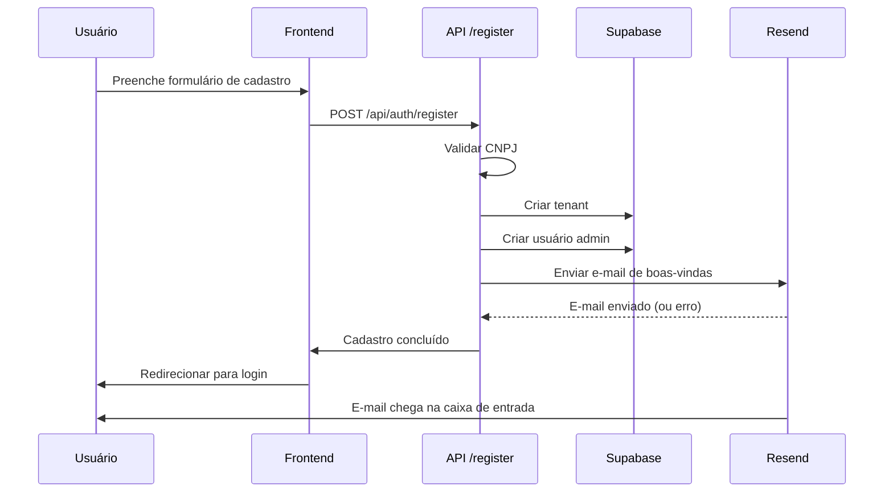

# 📧 E-mail de Boas-Vindas - Implementação Completa

## ✅ O que foi implementado

### 1. Template de E-mail (`lib/email-templates/boas-vindas.tsx`)
Template React com design profissional contendo:
- ✅ Confirmação de cadastro
- ✅ Dados da conta (e-mail, empresa, plano, trial)
- ✅ Botão de acesso ao sistema
- ✅ Próximos passos sugeridos
- ✅ Dica para começar
- ✅ Informações de suporte

### 2. Integração na API de Registro (`app/api/auth/register/route.ts`)
- ✅ Importação do template e cliente Resend
- ✅ Envio automático após criação da conta
- ✅ Tratamento de erros (não bloqueia o cadastro se o e-mail falhar)
- ✅ Formatação da data do trial em pt-BR

### 3. Variáveis de Ambiente
- ✅ `NEXT_PUBLIC_APP_URL` - URL da aplicação para links no e-mail
- ✅ Adicionada no `.env.local` e `.env.example`

### 4. Documentação
- ✅ README dos templates (`lib/email-templates/README.md`)
- ✅ Script de teste (`testar-email-boas-vindas.js`)
- ✅ Este documento

## 🧪 Como Testar

### Opção 1: Script de Teste (Recomendado)

```bash
# Testar envio de e-mail sem cadastrar uma conta
node testar-email-boas-vindas.js seu-email@exemplo.com
```

**Vantagem:** Testa apenas o envio do e-mail, sem criar dados no banco.

### Opção 2: Cadastro Real

```bash
# Iniciar servidor de desenvolvimento
npm run dev

# Acessar http://localhost:3000/cadastro
# Preencher formulário com dados de teste
# Verificar e-mail após cadastro
```

**Vantagem:** Testa todo o fluxo (cadastro + e-mail).

## ⚙️ Configuração do Resend

### 1. Criar Conta
- Acesse: https://resend.com
- Crie uma conta gratuita (100 e-mails/dia)

### 2. Obter API Key
- Acesse: https://resend.com/api-keys
- Clique em "Create API Key"
- Copie a chave (começa com `re_`)

### 3. Configurar no Projeto

#### Desenvolvimento Local
```env
# .env.local
RESEND_API_KEY=re_sua_chave_aqui
EMAIL_FROM=onboarding@resend.dev  # Para testes
```

#### Produção (Vercel)
```bash
vercel env add RESEND_API_KEY production
vercel env add EMAIL_FROM production
```

**Importante:** Em produção, use um domínio verificado:
- Adicione seu domínio no Resend
- Configure registros DNS (SPF, DKIM, DMARC)
- Use `EMAIL_FROM=noreply@seudominio.com.br`

## 📊 Verificar Envios

Dashboard do Resend: https://resend.com/emails

Aqui você pode ver:
- ✅ Status: enviado, entregue, aberto
- ✅ Preview do e-mail
- ✅ Logs de erros
- ✅ Métricas de engajamento

## 🔍 Troubleshooting

### Erro: "API key not configured"
```bash
# Verifique se a chave está no .env.local
cat .env.local | grep RESEND_API_KEY

# Se não estiver, adicione:
echo "RESEND_API_KEY=re_sua_chave" >> .env.local
```

### Erro: "Email address not verified"
```bash
# Use o e-mail de teste do Resend
# No .env.local:
EMAIL_FROM=onboarding@resend.dev
```

### E-mail não chega
1. ✅ Verifique spam/lixeira
2. ✅ Confirme que a API key está correta
3. ✅ Veja logs no dashboard do Resend
4. ✅ Tente com EMAIL_FROM=onboarding@resend.dev

### Erro: "Invalid recipient"
```bash
# Certifique-se de passar um e-mail válido:
node testar-email-boas-vindas.js email@valido.com
```

## 📝 Fluxo Completo



**Nota:** Se o e-mail falhar, o cadastro NÃO é bloqueado. O erro é apenas logado no console.

## 🎨 Preview do E-mail

O e-mail contém:

### Header (Verde)
```
╔══════════════════════════════════╗
║         SupriFlow                ║
║  Bem-vindo ao futuro da gestão!  ║
╚══════════════════════════════════╝
```

### Corpo (Branco)
- 🎉 Título: "Conta criada com sucesso!"
- 👤 Saudação personalizada
- 📋 Box verde com dados da conta
- 🚀 Botão "Acessar SupriFlow"
- 🚀 Lista de próximos passos
- 💡 Dica para começar
- 📧 Informações de suporte

### Footer (Cinza)
- Aviso de e-mail automático
- Copyright

## 🚀 Próximos Passos

Agora que o e-mail de boas-vindas está implementado, você pode:

1. **Testar o envio**
   ```bash
   node testar-email-boas-vindas.js seu-email@exemplo.com
   ```

2. **Criar uma conta de teste**
   - Acesse http://localhost:3000/cadastro
   - Preencha com dados fictícios
   - Verifique o e-mail

3. **Implementar outros e-mails** (veja `lib/email-templates/README.md`)
   - Cotação para fornecedor
   - Trial expirando
   - Pagamento pendente
   - Relatório mensal

4. **Configurar domínio em produção**
   - Adicionar domínio no Resend
   - Configurar DNS
   - Atualizar `EMAIL_FROM`

## 📚 Arquivos Modificados

```
✅ lib/email-templates/boas-vindas.tsx        (NOVO)
✅ lib/email-templates/README.md              (NOVO)
✅ app/api/auth/register/route.ts             (MODIFICADO)
✅ .env.local                                  (MODIFICADO)
✅ .env.example                                (MODIFICADO)
✅ testar-email-boas-vindas.js                (NOVO)
✅ EMAIL_BOAS_VINDAS.md                       (NOVO)
```

## ✨ Conclusão

O e-mail de boas-vindas está **100% funcional** e pronto para uso!

- ✅ Template profissional com design SupriFlow
- ✅ Integrado no fluxo de cadastro
- ✅ Tratamento de erros
- ✅ Script de teste
- ✅ Documentação completa

**Pendência:** Configure a `RESEND_API_KEY` no `.env.local` para habilitar o envio.
